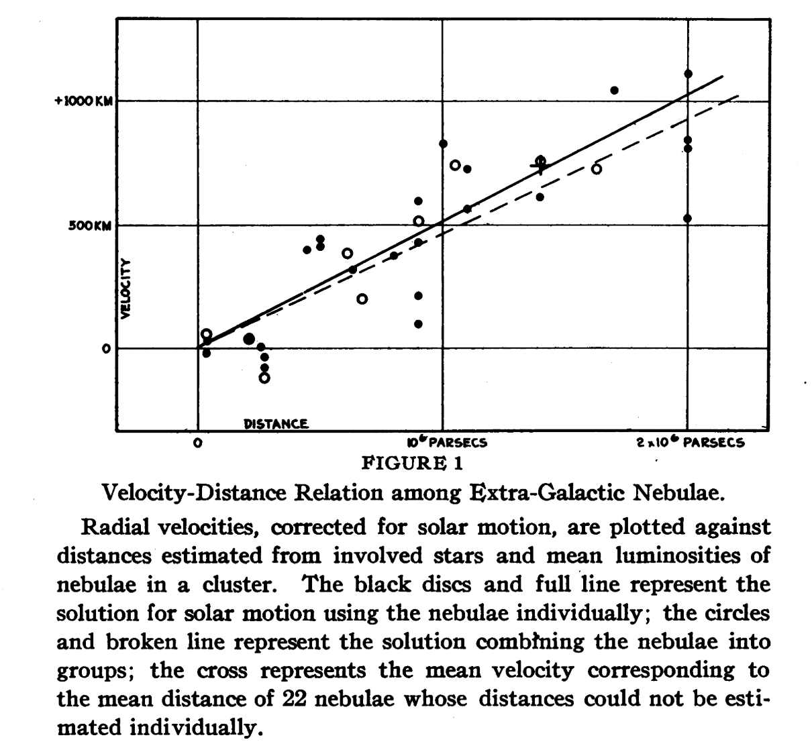

##  
::: {.columns .v-center-container}
::: {.column width="35%"}

:::
<!-- 
The above code needs an Internet connection to work. If you want to compile your work locally, a copy of the image can be found in the _extensions folder. 
You can assessing it by adopting the following:
 -->
::: {.column width="65%"}
[Welcome!]{.section-header-text}
:::
:::

---

### In these lectures

#### Week 4

- Lines of Best Fit
    - recap of RANSAC, Theil-Sen
    - ordinary least squares fits 
    - multivariate ordinary least squares
    - fitting higher order models by least squares
    - least squares as maximum likelihood with Gaussian errors
- Classification
    - Bernoulli (coin-flip) distribution
    - log-odds and logistic regression


### Fitting a Line to Data

The most important thing in your whole job will be _learning_ from data: finding a mathematical representation that explains current data and predicts new data.

This can be as simple as _fitting a line_.

```{python}
#| echo: false
#| eval: true

x = np.random.rand(200)
xx = np.linspace(-0.1,1.1,10000)
y = 0.5*x + 0.1 + 0.2*np.random.randn(len(x))
plt.plot(x,y,'.',label='Data')
plt.plot(xx,0.5*xx+0.1,'--',label='Line of best fit')
plt.xlabel('Time (h)')
plt.ylabel('Student Sleepiness')
plt.xlim(0,1);
```

I think that's time for a break!

---

### The Expanding Universe


---

### Hubble's Original Data

Here are some distances from Edwin Hubble's [1929 paper](https://www.pnas.org/doi/pdf/10.1073/pnas.15.3.168) discovering the expansion of the universe. 



---

### Load and plot Hubble original data

```{python}
#| echo: true
#| eval: true

data = pd.read_csv('hubble.txt')
d, v = data.r, data.v
d_err = 0.1
plt.errorbar(d,v,xerr=d_err,fmt='o',color='k')
plt.xlabel('Distance (Mpc)')
plt.ylabel('RV (km/s)');
```

---

### Fitting a line to data

Our model for a uniformly expanding universe is that $v = H_0 d$. In your lectures so far you've learnt about outlier-resistant methods for fitting lines to data; we're going to look at something more general and *statistical*: ordinary least squares. 
